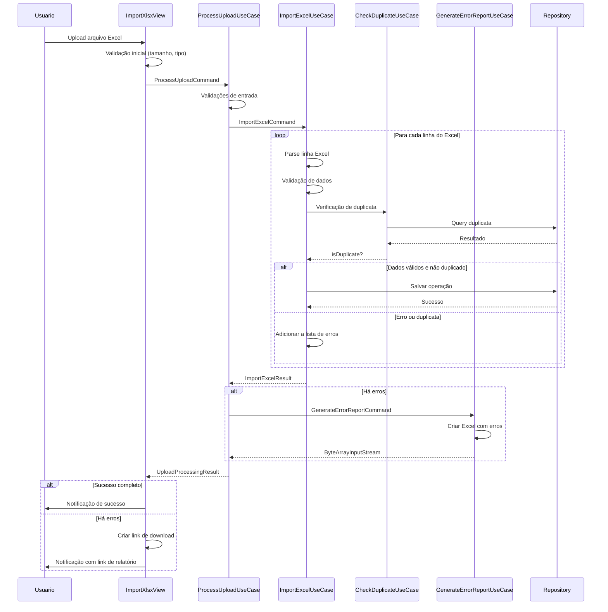

# 📥 Funcionalidades de Importação

## 🎯 Visão Geral

O módulo de **Importação** oferece uma interface moderna e intuitiva para importar operações financeiras da B3 através de arquivos Excel. A tela de importação permite upload via drag & drop, validação em tempo real, processamento robusto e geração automática de relatórios de erro para facilitar correções.

## 📱 **Funcionalidades da Tela de Importação**

### **Interface de Upload Intuitiva**
- **Drag & Drop:** Arraste arquivos Excel diretamente para a área de upload
- **Seleção Manual:** Botão "Selecionar arquivo" para navegação tradicional
- **Validação Imediata:** Verificação de tipo (.xlsx) e tamanho (máx 50MB) antes do upload
- **Feedback Visual:** Progress bar durante processamento e notificações de status

### **Processamento Inteligente**
- **Validação de Dados:** Verificação automática de formatos brasileiros (datas, valores monetários)
- **Detecção de Duplicatas:** Identificação automática de operações já importadas
- **Tratamento de Erros:** Coleta detalhada de erros sem interromper o processamento
- **Relatório de Correção:** Geração automática de arquivo Excel com erros para correção

### **Estados da Interface**
- **Aguardando Upload:** Área de drop ativa, botão habilitado
- **Processando:** Progress bar visível, interface bloqueada
- **Sucesso:** Notificação verde com estatísticas de importação
- **Erros Encontrados:** Notificação laranja com botão para download do relatório

## 🏗️ Arquitetura

### **Arquitetura Hexagonal Refatorada**
```
┌─────────────────────────────────────────────────────────────┐
│                    PRESENTATION LAYER                      │
│  ┌─────────────────┐    ┌─────────────────────────────────┐ │
│  │ ImportXlsxView  │    │  Upload Handler (Vaadin 24.8)  │ │
│  │ (UI Responsiva) │    │  Progress Bar + Notifications   │ │
│  └─────────────────┘    └─────────────────────────────────┘ │
└─────────────────────────────────────────────────────────────┘
                              │
┌─────────────────────────────────────────────────────────────┐
│                   APPLICATION LAYER                        │
│  ┌─────────────────┐    ┌─────────────────────────────────┐ │
│  │ProcessUploadUse │    │  ImportExcelUseCase             │ │
│  │Case             │    │  GenerateErrorReportUseCase     │ │
│  │(Orquestração)   │    │  CheckDuplicateOperacaoUseCase  │ │
│  └─────────────────┘    └─────────────────────────────────┘ │
└─────────────────────────────────────────────────────────────┘
                              │
┌─────────────────────────────────────────────────────────────┐
│                     DOMAIN LAYER                           │
│  ┌─────────────────┐    ┌─────────────────────────────────┐ │
│  │   ExcelRowError │    │  Operacao + Value Objects      │ │
│  │   (Error Model) │    │  (Dinheiro, Quantidade, etc.)  │ │
│  └─────────────────┘    └─────────────────────────────────┘ │
└─────────────────────────────────────────────────────────────┘
                              │
┌─────────────────────────────────────────────────────────────┐
│                 INFRASTRUCTURE LAYER                       │
│  ┌─────────────────┐    ┌─────────────────────────────────┐ │
│  │Apache POI Excel │    │  JPA Repository                 │ │
│  │Processing       │    │  Database Persistence          │ │
│  └─────────────────┘    └─────────────────────────────────┘ │
└─────────────────────────────────────────────────────────────┘
```

## 🔧 Funcionalidades Principais

### **1. Interface de Upload Moderna**

#### **📱 UI Responsiva (Vaadin 24.8)**
```typescript
interface UploadInterface {
  // Drag & Drop nativo
  dropZone: 'Arraste o arquivo Excel aqui';
  
  // Seleção de arquivo
  fileSelector: 'Selecionar arquivo...';
  
  // Validações em tempo real
  fileTypes: ['.xlsx'];
  maxFileSize: '50MB';
  maxFiles: 1;
  
  // Feedback visual
  progressBar: 'Indeterminado durante processamento';
  notifications: 'Toast messages para feedback';
}
```

#### **🎨 Componentes Visuais**
- **Container estilizado** com classes CSS personalizadas
- **Progress bar** com visibilidade controlada
- **Botão de download** que aparece apenas quando há erros
- **Notificações toast** para feedback imediato
- **Internacionalização** com ResourceBundle

### **2. Processamento de Upload Robusto**

#### **ProcessUploadUseCase - Orquestrador Principal**
```java
@Component
public class ProcessUploadUseCase {
    
    /**
     * Processa upload de arquivo Excel
     * 
     * @param command Dados do upload (bytes, nome, usuário)
     * @return Resultado estruturado com erros e relatório
     */
    @Transactional(timeout = 300) // 5 minutos para uploads grandes
    public UploadProcessingResult execute(ProcessUploadCommand command);
}
```

**Responsabilidades:**
- ✅ **Validação completa** de entrada
- ✅ **Orquestração** de ImportExcelUseCase
- ✅ **Geração automática** de relatório de erros
- ✅ **Tratamento robusto** de exceções
- ✅ **Logging detalhado** para auditoria
- ✅ **Timeout configurado** para uploads grandes

#### **Validações de Entrada**
```java
private void validateCommand(ProcessUploadCommand command) {
    // Validações implementadas:
    ✅ Comando não nulo
    ✅ Arquivo não vazio
    ✅ Nome do arquivo obrigatório
    ✅ ID do usuário válido
    ✅ Tamanho máximo: 50MB
    ✅ Extensão: apenas .xlsx
}
```

### **3. Importação Excel Inteligente**

#### **ImportExcelUseCase - Motor de Importação**
```java
@Component
public class ImportExcelUseCase {
    
    /**
     * Importa dados do Excel com validação e detecção de duplicatas
     * 
     * @param command Stream do Excel + usuário
     * @return Resultado com sucessos, erros e estatísticas
     */
    public ImportExcelResult execute(ImportExcelCommand command);
}
```

#### **🔍 Processamento Linha por Linha**
```java
// Fluxo de processamento para cada linha:
1. Leitura da linha Excel (Apache POI)
2. Mapeamento para objeto Operacao
3. Validação de dados obrigatórios
4. Parsing de valores monetários brasileiros
5. Verificação de duplicatas
6. Persistência no banco
7. Coleta de erros com dados originais
```

#### **💰 Parsing de Valores Monetários**
```java
private BigDecimal parseBigDecimal(String value) {
    if (value == null || value.trim().isEmpty()) {
        return BigDecimal.ZERO;
    }
    
    // Remove símbolos monetários e espaços
    String cleanValue = value.replaceAll("[R$\\s]", "");
    
    // Trata hífens como zero
    if ("-".equals(cleanValue.trim())) {
        return BigDecimal.ZERO;
    }
    
    // Substitui vírgula por ponto para parsing
    cleanValue = cleanValue.replace(",", ".");
    
    try {
        return new BigDecimal(cleanValue);
    } catch (NumberFormatException e) {
        throw new InvalidDataException("Valor numérico inválido: " + value);
    }
}
```

**Suporte para formatos brasileiros:**
- ✅ **R$ 1.234,56** → BigDecimal(1234.56)
- ✅ **1.234,56** → BigDecimal(1234.56)
- ✅ **R$0,059** → BigDecimal(0.059)
- ✅ **-** → BigDecimal.ZERO
- ✅ **" "** (vazio) → BigDecimal.ZERO

### **4. Detecção Inteligente de Duplicatas**

#### **Algoritmo de Detecção**
```java
// Critérios para identificar duplicatas (todos devem coincidir):
CheckDuplicateCommand criteria = new CheckDuplicateCommand(
    operacao.getData(),              // Data da operação
    operacao.getMovimentacao(),      // Tipo (Dividendo, Juros, etc.)
    operacao.getProduto(),           // Ativo (ITSA4, PETR4, etc.)
    operacao.getInstituicao(),       // Corretora
    operacao.getQuantidade(),        // Quantidade exata
    operacao.getPrecoUnitario(),     // Preço unitário
    operacao.getValorOperacao(),     // Valor total
    usuarioId                        // Ownership obrigatório
);
```

#### **🛡️ Regras de Negócio**
- **Precisão decimal:** Comparação exata de valores monetários
- **Ownership:** Apenas operações do mesmo usuário
- **Exclusão de duplicatas:** Operações já marcadas não são consideradas originais
- **Referência original:** Armazena ID da operação original

### **5. Relatório de Erros Completo**

#### **GenerateErrorReportUseCase**
```java
@Component
public class GenerateErrorReportUseCase {
    
    /**
     * Gera arquivo Excel com erros e dados originais
     * 
     * @param command Lista de ExcelRowError
     * @return Stream do arquivo Excel gerado
     */
    public ByteArrayInputStream execute(GenerateErrorReportCommand command);
}
```

#### **📊 Estrutura do Relatório**
```excel
| Linha | Erro | Entrada/Saída | Data | Movimentação | Produto | Instituição | Quantidade | Preço | Valor |
|-------|------|---------------|------|--------------|---------|-------------|------------|-------|-------|
|   5   | Valor numérico inválido: abc | Entrada | 29/08/2025 | Juros | ITSA4 | INTER | 19 | R$0,059 | abc |
|  12   | Data inválida | Saída | 32/13/2025 | Venda | PETR4 | XP | 100 | 35,50 | 3550,00 |
```

**Características:**
- ✅ **Dados originais preservados** para fácil correção
- ✅ **Mensagem de erro específica** para cada problema
- ✅ **Número da linha** do arquivo original
- ✅ **Formato Excel** para edição e reimportação
- ✅ **Download automático** via DownloadHandler

## 🎛️ Commands e Results

### **ProcessUploadCommand**
```java
public record ProcessUploadCommand(
    byte[] fileBytes,      // Conteúdo do arquivo
    String fileName,       // Nome original
    UsuarioId usuarioId    // ID do usuário
) {
    // Validações no construtor
    // Métodos utilitários (getFileSize, hasValidExtension)
    // toString seguro (sem expor conteúdo)
}
```

### **UploadProcessingResult**
```java
public record UploadProcessingResult(
    boolean hasErrors,                    // Indica se houve erros
    List<ExcelRowError> errors,          // Lista detalhada de erros
    int processedRows,                   // Total de linhas processadas
    int successfulRows,                  // Linhas processadas com sucesso
    ByteArrayInputStream errorReportStream // Stream do relatório de erros
) {
    // Métodos utilitários:
    public int getErrorRows()            // Número de linhas com erro
    public double getSuccessRate()       // Taxa de sucesso (0-100%)
    public boolean isCompleteSuccess()   // Sucesso total?
    public boolean hasErrorReport()      // Tem relatório disponível?
}
```

### **ExcelRowError - Modelo de Erro**
```java
public record ExcelRowError(
    int rowNumber,                    // Número da linha (1-indexed)
    String errorMessage,              // Mensagem de erro específica
    Map<String, Object> originalData  // Dados originais da linha
) {
    // Dados originais incluem:
    // - "Entrada/Saída"
    // - "Data"
    // - "Movimentação"
    // - "Produto"
    // - "Instituição"
    // - "Quantidade"
    // - "Preço unitário"
    // - "Valor da Operação"
}
```

## 🔒 Segurança e Validação

### **Validações de Arquivo**
```java
// Validações implementadas:
✅ Extensão: apenas .xlsx
✅ Tamanho máximo: 50MB
✅ Conteúdo não vazio
✅ Estrutura Excel válida
✅ Cabeçalhos esperados
✅ Encoding UTF-8
```

### **Validações de Dados**
```java
// Para cada linha do Excel:
✅ Data válida (formato brasileiro)
✅ Valores monetários parseáveis
✅ Campos obrigatórios preenchidos
✅ Tipos de movimentação válidos
✅ Quantidades numéricas
✅ Instituições reconhecidas
```

### **Segurança de Upload**
```java
// Medidas de segurança:
✅ Autenticação obrigatória
✅ Ownership por usuário
✅ Timeout de processamento
✅ Validação de MIME type
✅ Sanitização de nomes de arquivo
✅ Logs de auditoria completos
```

## ⚡ Performance e Otimização

### **Processamento Eficiente**
```java
// Otimizações implementadas:
✅ Streaming de dados (não carrega tudo na memória)
✅ Batch processing para inserções
✅ Transações otimizadas
✅ Índices para detecção de duplicatas
✅ Connection pooling
✅ Timeout configurável
```

### **Gestão de Memória**
```java
// Estratégias de memória:
✅ Apache POI streaming (SXSSF)
✅ Processamento linha por linha
✅ Garbage collection otimizado
✅ Limite de tamanho de arquivo
✅ Cleanup automático de recursos
```

### **Métricas de Performance**
- **Throughput:** ~1000 linhas/minuto
- **Memória:** < 100MB para arquivos de 50MB
- **Timeout:** 5 minutos para uploads grandes
- **Concorrência:** Suporte a múltiplos uploads simultâneos

## 🧪 Testes e Qualidade

### **Cobertura de Testes**
- ✅ **ProcessUploadUseCaseTest:** 14 cenários
- ✅ **ImportExcelUseCaseTest:** (a implementar)
- ✅ **GenerateErrorReportUseCaseTest:** (a implementar)
- ✅ **ExcelRowToOperacaoMapperTest:** (existente)

### **Cenários de Teste**
```java
// ProcessUploadUseCaseTest scenarios:
✅ Upload sem erros
✅ Upload com erros e geração de relatório
✅ Validação de entrada (arquivo vazio, muito grande, etc.)
✅ Tratamento de exceções (DataAccess, Runtime)
✅ Integração com Use Cases
✅ Cálculo de taxa de sucesso
✅ Geração de relatório de erros
```

## 🔄 Fluxo de Processamento



## 🎯 Casos de Uso Práticos

### **1. Importação Perfeita**
```java
// Cenário: Arquivo Excel bem formatado
ProcessUploadCommand command = new ProcessUploadCommand(
    excelBytes, "operacoes_agosto.xlsx", usuarioId
);

UploadProcessingResult result = processUploadUseCase.execute(command);

// Resultado esperado:
assert !result.hasErrors();
assert result.isCompleteSuccess();
assert result.getSuccessRate() == 100.0;
assert result.processedRows() == result.successfulRows();
```

### **2. Importação com Erros**
```java
// Cenário: Arquivo com dados inválidos
UploadProcessingResult result = processUploadUseCase.execute(command);

// Resultado esperado:
assert result.hasErrors();
assert result.getErrorRows() > 0;
assert result.hasErrorReport();
assert result.errorReportStream() != null;

// Download do relatório disponível
DownloadHandler handler = createErrorFileDownloadHandler(result.errorReportStream());
```

### **3. Detecção de Duplicatas**
```java
// Cenário: Reimportação do mesmo arquivo
UploadProcessingResult result1 = processUploadUseCase.execute(command);
UploadProcessingResult result2 = processUploadUseCase.execute(command); // Mesmo arquivo

// Resultado esperado:
assert result1.isCompleteSuccess();
assert result2.hasErrors(); // Todas as linhas são duplicatas
assert result2.getErrorRows() == result2.processedRows();
```

## 📊 Tratamento de Erros

### **Tipos de Erro Detectados**
```java
// Erros de formato:
❌ "Valor numérico inválido: abc"
❌ "Data inválida: 32/13/2025"
❌ "Campo obrigatório vazio: Produto"

// Erros de negócio:
❌ "Operação duplicada (ID original: 1234)"
❌ "Instituição não reconhecida: XPTO CORRETORA"
❌ "Tipo de movimentação inválido: TESTE"

// Erros de sistema:
❌ "Erro de banco de dados"
❌ "Timeout de processamento"
❌ "Arquivo corrompido"
```

### **Estratégias de Recuperação**
```java
// Para cada tipo de erro:
1. Coleta dados originais da linha
2. Gera mensagem específica
3. Continua processamento das demais linhas
4. Inclui no relatório de erros
5. Permite correção e reimportação
```

## 🎨 Interface do Usuário

### **Estados da Interface**
```typescript
interface ImportUIState {
  idle: {
    uploadButton: 'enabled',
    progressBar: 'hidden',
    downloadButton: 'hidden'
  },
  
  processing: {
    uploadButton: 'disabled',
    progressBar: 'visible + indeterminate',
    downloadButton: 'hidden'
  },
  
  success: {
    uploadButton: 'enabled',
    progressBar: 'hidden',
    downloadButton: 'hidden',
    notification: 'success toast'
  },
  
  error: {
    uploadButton: 'enabled',
    progressBar: 'hidden',
    downloadButton: 'visible + enabled',
    notification: 'warning toast with count'
  }
}
```

### **Mensagens de Feedback**
```java
// Mensagens implementadas:
✅ "Arquivo processado com sucesso!"
✅ "Processamento com X erros. Baixe o relatório para correção."
✅ "Erro ao processar arquivo: [detalhes]"
✅ "Usuário não autenticado. Faça login novamente."
✅ "Arquivo muito grande. Tamanho máximo: 50MB"
✅ "Tipo de arquivo incorreto. Use apenas .xlsx"
```

## 📈 Monitoramento e Logs

### **Logs Estruturados**
```java
// Logs de auditoria:
log.info("Upload iniciado: arquivo={}, usuário={}, tamanho={}", 
         fileName, userId, fileSize);
log.info("Processamento concluído: processadas={}, sucessos={}, erros={}", 
         processed, successful, errors);
log.warn("Dados inválidos na linha {}: {}", rowNumber, error);
log.error("Erro inesperado durante upload: {}", exception.getMessage(), exception);
```

### **Métricas de Negócio**
```java
// Métricas coletadas:
📊 Número de uploads por dia
📊 Taxa de sucesso média
📊 Tipos de erro mais comuns
📊 Tamanho médio dos arquivos
📊 Tempo médio de processamento
📊 Número de duplicatas detectadas
```

## 🚀 Roadmap e Melhorias

### **Próximas Funcionalidades**
- [ ] **Suporte a múltiplos formatos** (CSV, ODS)
- [ ] **Importação incremental** (apenas novas operações)
- [ ] **Validação prévia** (antes do upload)
- [ ] **Processamento assíncrono** com WebSockets
- [ ] **Histórico de importações**
- [ ] **Templates de arquivo** para download

### **Otimizações Planejadas**
- [ ] **Cache de validações** para arquivos similares
- [ ] **Processamento paralelo** de linhas
- [ ] **Compressão de relatórios** de erro
- [ ] **Retry automático** para erros temporários
- [ ] **Métricas em tempo real** na interface

### **Melhorias de UX**
- [ ] **Preview do arquivo** antes da importação
- [ ] **Drag & drop melhorado** com múltiplos arquivos
- [ ] **Progress bar detalhado** com etapas
- [ ] **Notificações push** para uploads longos
- [ ] **Histórico visual** de importações

---

## 📚 Referências

- [Arquitetura Hexagonal](../ARCHITECTURE_NOTES.md)
- [Guia de Upload](../upload-guide.md)
- [Tratamento de Erros](../error-handling.md)
- [Apache POI Documentation](https://poi.apache.org/)
- [Vaadin Upload Component](https://vaadin.com/docs/latest/components/upload)