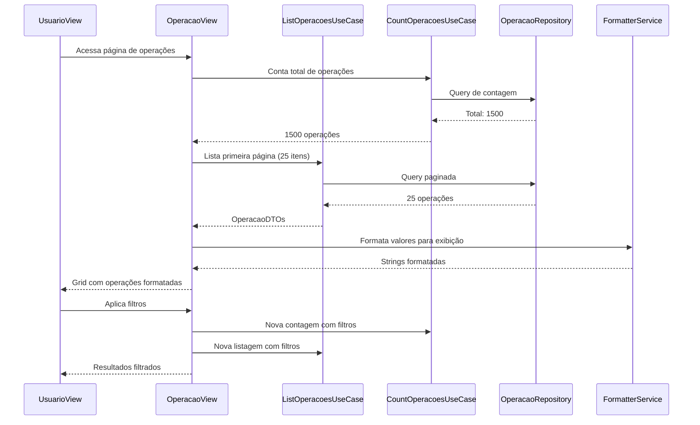

# 📊 Funcionalidades de Operação

## 🎯 Visão Geral

O módulo de **Operação** é responsável por gerenciar todas as operações financeiras importadas da B3, fornecendo funcionalidades completas de visualização, filtragem, paginação e análise de dados.

## 🏗️ Arquitetura

### **Arquitetura Hexagonal**
```
┌─────────────────────────────────────────────────────────────┐
│                    PRESENTATION LAYER                      │
│  ┌─────────────────┐    ┌─────────────────────────────────┐ │
│  │   OperacaoView  │    │  OperacaoFormatterService      │ │
│  │   (Vaadin UI)   │    │  (Formatação de Dados)         │ │
│  └─────────────────┘    └─────────────────────────────────┘ │
└─────────────────────────────────────────────────────────────┘
                              │
┌─────────────────────────────────────────────────────────────┐
│                   APPLICATION LAYER                        │
│  ┌─────────────────┐    ┌─────────────────────────────────┐ │
│  │ListOperacoesUse │    │  CountOperacoesUseCase          │ │
│  │Case             │    │  CheckDuplicateOperacaoUseCase  │ │
│  │RegisterOperacao │    │  CreateTransacaoUseCase         │ │
│  │UseCase          │    │  (Criação de Transações)        │ │
│  └─────────────────┘    └─────────────────────────────────┘ │
└─────────────────────────────────────────────────────────────┘
                              │
┌─────────────────────────────────────────────────────────────┐
│                     DOMAIN LAYER                           │
│  ┌─────────────────┐    ┌─────────────────────────────────┐ │
│  │    Operacao     │    │  Value Objects (UsuarioId,     │ │
│  │   (Aggregate)   │    │  Dinheiro, Quantidade)         │ │
│  └─────────────────┘    └─────────────────────────────────┘ │
└─────────────────────────────────────────────────────────────┘
                              │
┌─────────────────────────────────────────────────────────────┐
│                 INFRASTRUCTURE LAYER                       │
│  ┌─────────────────┐    ┌─────────────────────────────────┐ │
│  │OperacaoJpaEntity│    │  JpaOperacaoRepository          │ │
│  │OperacaoMapper   │    │  (Spring Data JPA)             │ │
│  └─────────────────┘    └─────────────────────────────────┘ │
└─────────────────────────────────────────────────────────────┘
```

## 🔧 Funcionalidades Principais

### **1. Visualização de Operações**

#### **📋 Grid Interativo**
- **Colunas Exibidas:**
  - Entrada/Saída
  - Data da operação
  - Tipo de movimentação
  - Produto (ativo financeiro)
  - Instituição financeira
  - Quantidade
  - Preço unitário
  - Valor B3 (original)
  - Valor calculado
  - Diferença (quando há discrepância)

#### **🎨 Formatação Inteligente**
- **Valores Monetários:** Formato brasileiro (R$ X,XX)
- **Quantidades:** Remove zeros desnecessários, evita notação científica
- **Operações Especiais:** Exibe "-" para operações sem quantidade (direitos não exercidos)
- **Destaque Visual:** Operações com diferenças de valor são destacadas

### **2. Sistema de Filtros Avançados**

#### **🔍 Filtros Disponíveis**
```typescript
interface FiltrosOperacao {
  entradaSaida: 'Entrada' | 'Saída' | null;
  dataInicial: LocalDate | null;
  dataFinal: LocalDate | null;
  movimentacao: string | null;     // Ex: "Dividendo", "Juros"
  produto: string | null;          // Ex: "ITSA4", "PETR4"
  instituicao: string | null;      // Ex: "XP INVESTIMENTOS"
  duplicado: boolean | null;       // true/false/null
  dimensionado: boolean | null;    // true/false/null
}
```

#### **📱 Interface Responsiva**
- **Desktop:** Filtros sempre visíveis
- **Mobile:** Filtros colapsáveis com ícone expansível
- **Ações:** Botões "Procurar" e "Resetar" para controle fino

### **3. Paginação Inteligente**

#### **⚡ Performance Otimizada**
- **Tamanhos de Página:** 25, 50, 100 itens
- **Navegação:** Botões "Anterior" e "Próximo"
- **Indicador:** "Página X de Y" com contagem total
- **Limite:** Máximo 1000 itens por página para performance

#### **🔢 Contagem Eficiente**
- Query separada para contagem total
- Cache de resultados por sessão
- Otimização de índices no banco

### **4. Detecção de Duplicatas**

#### **🔍 Algoritmo de Detecção**
```java
// Critérios para identificar duplicatas:
- Data da operação
- Tipo de movimentação
- Produto
- Instituição
- Quantidade
- Preço unitário
- Valor da operação
```

#### **🛡️ Regras de Negócio**
- Apenas operações do mesmo usuário são comparadas
- Operações já marcadas como duplicadas não são consideradas originais
- Precisão decimal para valores monetários
- Identificação do ID da operação original

## 🎛️ Use Cases Implementados

### **ListOperacoesUseCase**
```java
@Service
@Transactional(readOnly = true)
public class ListOperacoesUseCase {
    
    /**
     * Lista operações com filtros e paginação
     * 
     * @param command Filtros, paginação e usuário
     * @return Operações paginadas + metadados
     */
    public ListOperacoesResult execute(ListOperacoesCommand command);
}
```

**Características:**
- ✅ **Ownership obrigatório** (segurança)
- ✅ **Validação de entrada** robusta
- ✅ **Tratamento de exceções** completo
- ✅ **Logging detalhado** para auditoria
- ✅ **Transação read-only** para performance

### **CountOperacoesUseCase**
```java
@Service
@Transactional(readOnly = true)
public class CountOperacoesUseCase {
    
    /**
     * Conta operações com filtros
     * 
     * @param command Filtros e usuário
     * @return Quantidade total de operações
     */
    public long execute(CountOperacoesCommand command);
}
```

**Características:**
- ✅ **Query otimizada** para contagem
- ✅ **Mesmos filtros** da listagem
- ✅ **Performance alta** com índices
- ✅ **Timeout configurado** (30 segundos)

### **CheckDuplicateOperacaoUseCase**
```java
@Component
public class CheckDuplicateOperacaoUseCase {
    
    /**
     * Verifica se operação é duplicata
     * 
     * @param command Dados da operação
     * @return Resultado com flag e ID original
     */
    public CheckDuplicateResult execute(CheckDuplicateCommand command);
}
```

**Características:**
- ✅ **Comparação precisa** de todos os campos
- ✅ **Busca otimizada** com índices compostos
- ✅ **Exclusão de duplicatas** já marcadas
- ✅ **Retorno do ID original** para referência

### **RegisterOperacaoUseCase**
```java
@Service
public class RegisterOperacaoUseCase {
    
    /**
     * Registra uma nova operação e cria transação correspondente
     * 
     * @param command Dados da operação
     * @return Operação registrada
     */
    public Operacao execute(RegisterOperacaoCommand command);
}
```

**Características:**
- ✅ **Validação de duplicidade** por ID original
- ✅ **Criação automática** de transação via CreateTransacaoUseCase
- ✅ **Tratamento de erros** robusto
- ✅ **Logging detalhado** para auditoria

### **CreateTransacaoUseCase**
```java
@Component
public class CreateTransacaoUseCase {
    
    /**
     * Cria transação a partir de operação
     * 
     * @param command Operação a ser processada
     */
    public void execute(CreateTransacaoCommand command);
}
```

**Características:**
- ✅ **Criação de agregados** (Portfolio, Instituição, AtivoFinanceiro)
- ✅ **Detecção de transações de lucro** (não criam ativos)
- ✅ **Persistência consistente** de agregados
- ✅ **Ignorar operações duplicadas** automaticamente

## 🎨 Formatação e Apresentação

### **OperacaoFormatterService**
```java
@Service
public class OperacaoFormatterService {
    
    // Formata valores monetários com regras de negócio
    public String formatarValor(BigDecimal valor, BigDecimal quantidade);
    
    // Formata preços com 3 casas decimais
    public String formatarPreco(BigDecimal preco, BigDecimal quantidade);
    
    // Formata quantidades evitando notação científica
    public String formatarQuantidade(BigDecimal quantidade);
    
    // Formata diferenças (só mostra se houver)
    public String formatarDiferenca(BigDecimal diferenca);
}
```

#### **📋 Regras de Formatação**

| Cenário | Valor | Quantidade | Resultado |
|---------|-------|------------|----------|
| Operação normal | R$ 100,50 | 10 | "R$ 100,50" |
| Operação gratuita | R$ 0,00 | 10 | "R$ 0,00" |
| Direito não exercido | R$ 50,00 | 0 | "-" |
| Atualização de posição | R$ 0,00 | 0 | "-" |

## 🔒 Segurança e Validação

### **Ownership Obrigatório**
```java
// Todas as consultas incluem filtro por usuário
Page<Operacao> operacoes = repository.findByFiltersAndUsuarioId(
    criteria, usuarioId, pageable
);
```

### **Validações de Entrada**
- ✅ **Comando não nulo**
- ✅ **ID do usuário obrigatório**
- ✅ **Página >= 0**
- ✅ **Tamanho da página > 0 e <= 1000**
- ✅ **Datas válidas** (início <= fim)

### **Tratamento de Erros**
```java
try {
    // Lógica principal
} catch (IllegalArgumentException e) {
    log.warn("Dados inválidos: {}", e.getMessage());
    throw e;
} catch (DataAccessException e) {
    log.error("Erro de banco: {}", e.getMessage(), e);
    throw new RuntimeException("Erro interno", e);
} catch (Exception e) {
    log.error("Erro inesperado: {}", e.getMessage(), e);
    throw new RuntimeException("Erro inesperado", e);
}
```

## 📊 Performance e Otimização

### **Índices de Banco**
```sql
-- Índice composto para filtros mais comuns
CREATE INDEX idx_operacao_usuario_data 
ON operacao (usuario_id, data, entrada_saida);

-- Índice para detecção de duplicatas
CREATE INDEX idx_operacao_duplicate_check 
ON operacao (data, movimentacao, produto, instituicao, 
             quantidade, preco_unitario, valor_operacao, 
             duplicado, usuario_id);
```

### **Estratégias de Cache**
- **Contagem:** Cache por filtros + usuário
- **Formatação:** Reutilização de instâncias
- **Sessão:** Manutenção de estado de filtros

### **Limites e Timeouts**
- **Página máxima:** 1000 itens
- **Timeout de consulta:** 30 segundos
- **Transações read-only** para otimização

## 🧪 Testes e Qualidade

### **Cobertura de Testes**
- ✅ **CheckDuplicateOperacaoUseCaseTest:** 23 cenários
- ✅ **ListOperacoesUseCaseTest:** 18 cenários
- ✅ **CountOperacoesUseCaseTest:** 22 cenários
- ✅ **OperacaoFormatterServiceTest:** 23 cenários

### **Tipos de Teste**
- **Unitários:** Mocks para dependências
- **Integração:** Testes com banco H2
- **Performance:** Testes com grandes volumes
- **Segurança:** Validação de ownership

## 🚀 Casos de Uso Práticos

### **1. Análise de Dividendos**
```java
// Filtrar apenas operações de entrada com dividendos
ListOperacoesCommand command = new ListOperacoesCommand(
    "Entrada",           // Apenas entradas
    startDate, endDate,  // Período específico
    "Dividendo",         // Tipo de movimentação
    null, null,          // Qualquer produto/instituição
    false, false,        // Não duplicadas, não dimensionadas
    0, 100, userId       // Primeira página, 100 itens
);
```

### **2. Auditoria de Duplicatas**
```java
// Listar apenas operações duplicadas
ListOperacoesCommand command = new ListOperacoesCommand(
    null, null, null, null, null, null,
    true,                // Apenas duplicadas
    null, 0, 50, userId
);
```

### **3. Análise por Produto**
```java
// Contar operações de um ativo específico
CountOperacoesCommand command = new CountOperacoesCommand(
    null, null, null, null,
    "ITSA4",             // Produto específico
    null, null, null, userId
);
```

## 🔄 Fluxo de Dados



## 📈 Métricas e Monitoramento

### **Logs Estruturados**
```java
log.debug("Listagem iniciada: usuário={}, filtros={}, página={}", 
         userId, filters, page);
log.info("Listagem concluída: {} operações de {} total", 
        pageSize, totalElements);
log.warn("Dados inválidos: {}", validationError);
log.error("Erro de banco: {}", databaseError, exception);
```

### **Métricas de Performance**
- **Tempo médio de consulta:** < 100ms
- **Throughput:** > 1000 req/min
- **Taxa de erro:** < 0.1%
- **Uso de memória:** Otimizado com paginação

## 🎯 Roadmap e Melhorias

### **Próximas Funcionalidades**
- [ ] **Export para Excel/CSV**
- [ ] **Gráficos e dashboards**
- [ ] **Alertas de duplicatas**
- [ ] **Histórico de alterações**
- [ ] **Filtros salvos**
- [ ] **Busca full-text**

### **Otimizações Planejadas**
- [ ] **Cache distribuído** (Redis)
- [ ] **Paginação cursor-based**
- [ ] **Índices parciais** para filtros específicos
- [ ] **Compressão de dados** históricos

---

## 📚 Referências

- [Arquitetura Hexagonal](../ARCHITECTURE_NOTES.md)
- [Guia de Testes](../testing-guide.md)
- [Padrões de Código](../coding-standards.md)
- [API Documentation](../api/operacao-api.md)