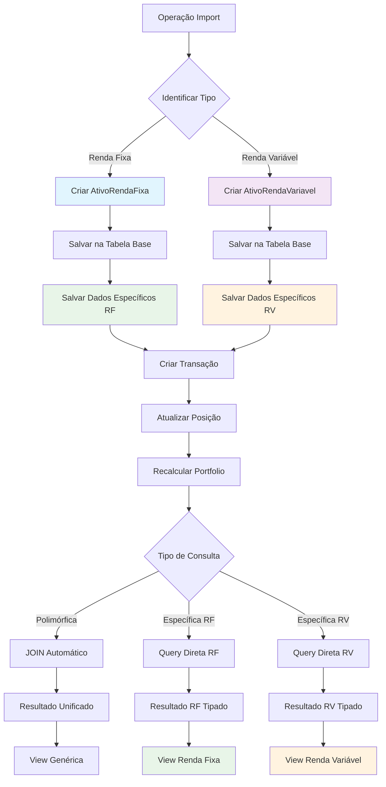

# Herança JPA - JOINED Strategy

## Visão Geral

Esta abordagem utiliza `@Inheritance(strategy = InheritanceType.JOINED)` para criar uma hierarquia de classes com tabelas separadas relacionadas por chave primária.

## Estrutura das Tabelas

### Tabela Base (ativo_financeiro)
```sql
CREATE TABLE ativo_financeiro (
    id BIGINT PRIMARY KEY AUTO_INCREMENT,
    codigo VARCHAR(20) NOT NULL UNIQUE,
    nome VARCHAR(200) NOT NULL,
    portfolio_id BIGINT NOT NULL,
    deletado BOOLEAN NOT NULL DEFAULT FALSE,
    tipo_ativo VARCHAR(31) NOT NULL, -- Discriminator
    created_at TIMESTAMP DEFAULT CURRENT_TIMESTAMP,
    updated_at TIMESTAMP DEFAULT CURRENT_TIMESTAMP ON UPDATE CURRENT_TIMESTAMP,
    
    INDEX idx_ativo_codigo (codigo),
    INDEX idx_ativo_tipo (tipo_ativo),
    INDEX idx_ativo_portfolio (portfolio_id),
    
    FOREIGN KEY (portfolio_id) REFERENCES portfolio(id)
);
```

### Tabela Específica - Renda Fixa
```sql
CREATE TABLE ativo_renda_fixa (
    id BIGINT PRIMARY KEY,
    taxa_juros DECIMAL(5,2) NOT NULL,
    data_vencimento DATE,
    indexador VARCHAR(50),
    emissor VARCHAR(200) NOT NULL,
    tipo_renda_fixa ENUM('CDB', 'LCI', 'LCA', 'TESOURO_DIRETO', 'DEBENTURE') NOT NULL,
    valor_minimo DECIMAL(15,2),
    liquidez_diaria BOOLEAN DEFAULT FALSE,
    
    INDEX idx_rf_tipo (tipo_renda_fixa),
    INDEX idx_rf_vencimento (data_vencimento),
    INDEX idx_rf_emissor (emissor),
    
    FOREIGN KEY (id) REFERENCES ativo_financeiro(id) ON DELETE CASCADE
);
```

### Tabela Específica - Renda Variável
```sql
CREATE TABLE ativo_renda_variavel (
    id BIGINT PRIMARY KEY,
    tipo_acao ENUM('ACAO', 'FII', 'ETF', 'BDR') NOT NULL,
    setor VARCHAR(100),
    segmento VARCHAR(100),
    ticker_yahoo VARCHAR(20),
    dividend_yield DECIMAL(5,4),
    free_float DECIMAL(5,2),
    market_cap BIGINT,
    
    INDEX idx_rv_tipo (tipo_acao),
    INDEX idx_rv_setor (setor),
    INDEX idx_rv_ticker (ticker_yahoo),
    
    FOREIGN KEY (id) REFERENCES ativo_financeiro(id) ON DELETE CASCADE
);
```

## Estrutura das Classes JPA

### Classe Base
```java
@Entity
@Table(name = "ativo_financeiro")
@Inheritance(strategy = InheritanceType.JOINED)
@DiscriminatorColumn(name = "tipo_ativo", discriminatorType = DiscriminatorType.STRING)
public abstract class AtivoFinanceiro {
    
    @Id
    @GeneratedValue(strategy = GenerationType.IDENTITY)
    private Long id;
    
    @Column(name = "codigo", nullable = false, unique = true, length = 20)
    private String codigo;
    
    @Column(name = "nome", nullable = false, length = 200)
    private String nome;
    
    @ManyToOne(fetch = FetchType.LAZY)
    @JoinColumn(name = "portfolio_id", nullable = false)
    private PortfolioEntity portfolio;
    
    @Column(name = "deletado", nullable = false)
    private Boolean deletado = false;
    
    @OneToMany(mappedBy = "ativoFinanceiro", cascade = CascadeType.ALL, fetch = FetchType.LAZY)
    private List<TransacaoEntity> transacoes = new ArrayList<>();
    
    @OneToMany(mappedBy = "ativoFinanceiro", cascade = CascadeType.ALL, fetch = FetchType.LAZY)
    private List<PosicaoEntity> posicoes = new ArrayList<>();
    
    @Column(name = "created_at", updatable = false)
    private LocalDateTime createdAt;
    
    @Column(name = "updated_at")
    private LocalDateTime updatedAt;
    
    // Métodos abstratos
    public abstract TipoAtivo getTipoAtivo();
    public abstract String getDescricaoCompleta();
    
    // Métodos de ciclo de vida
    @PrePersist
    protected void onCreate() {
        this.createdAt = LocalDateTime.now();
        this.updatedAt = LocalDateTime.now();
    }
    
    @PreUpdate
    protected void onUpdate() {
        this.updatedAt = LocalDateTime.now();
    }
    
    // Getters e Setters...
}
```

### Subclasse - Renda Fixa
```java
@Entity
@Table(name = "ativo_renda_fixa")
@DiscriminatorValue("RENDA_FIXA")
public class AtivoRendaFixa extends AtivoFinanceiro {
    
    @Column(name = "taxa_juros", nullable = false, precision = 5, scale = 2)
    private BigDecimal taxaJuros;
    
    @Column(name = "data_vencimento")
    private LocalDate dataVencimento;
    
    @Column(name = "indexador", length = 50)
    private String indexador;
    
    @Column(name = "emissor", nullable = false, length = 200)
    private String emissor;
    
    @Enumerated(EnumType.STRING)
    @Column(name = "tipo_renda_fixa", nullable = false)
    private TipoRendaFixa tipoRendaFixa;
    
    @Column(name = "valor_minimo", precision = 15, scale = 2)
    private BigDecimal valorMinimo;
    
    @Column(name = "liquidez_diaria")
    private Boolean liquidezDiaria = false;
    
    @Override
    public TipoAtivo getTipoAtivo() {
        return TipoAtivo.RENDA_FIXA;
    }
    
    @Override
    public String getDescricaoCompleta() {
        return String.format("%s - %s (%s) - %.2f%%", 
            getNome(), emissor, tipoRendaFixa, taxaJuros);
    }
    
    // Métodos específicos
    public boolean isVencido() {
        return dataVencimento != null && dataVencimento.isBefore(LocalDate.now());
    }
    
    public long getDiasParaVencimento() {
        return dataVencimento != null ? 
            ChronoUnit.DAYS.between(LocalDate.now(), dataVencimento) : 0;
    }
    
    public BigDecimal calcularRendimentoProjetado(BigDecimal valorInvestido) {
        if (dataVencimento == null) return BigDecimal.ZERO;
        
        long dias = getDiasParaVencimento();
        BigDecimal taxaDiaria = taxaJuros.divide(BigDecimal.valueOf(365), 8, RoundingMode.HALF_UP);
        return valorInvestido.multiply(taxaDiaria).multiply(BigDecimal.valueOf(dias));
    }
    
    // Getters e Setters...
}
```

### Subclasse - Renda Variável
```java
@Entity
@Table(name = "ativo_renda_variavel")
@DiscriminatorValue("RENDA_VARIAVEL")
public class AtivoRendaVariavel extends AtivoFinanceiro {
    
    @Enumerated(EnumType.STRING)
    @Column(name = "tipo_acao", nullable = false)
    private TipoAcao tipoAcao;
    
    @Column(name = "setor", length = 100)
    private String setor;
    
    @Column(name = "segmento", length = 100)
    private String segmento;
    
    @Column(name = "ticker_yahoo", length = 20)
    private String tickerYahoo;
    
    @Column(name = "dividend_yield", precision = 5, scale = 4)
    private BigDecimal dividendYield;
    
    @Column(name = "free_float", precision = 5, scale = 2)
    private BigDecimal freeFloat;
    
    @Column(name = "market_cap")
    private Long marketCap;
    
    @Override
    public TipoAtivo getTipoAtivo() {
        return TipoAtivo.RENDA_VARIAVEL;
    }
    
    @Override
    public String getDescricaoCompleta() {
        return String.format("%s (%s) - %s - %s", 
            getNome(), getCodigo(), tipoAcao, setor);
    }
    
    // Métodos específicos
    public boolean isAcao() {
        return TipoAcao.ACAO.equals(tipoAcao);
    }
    
    public boolean isFII() {
        return TipoAcao.FII.equals(tipoAcao);
    }
    
    public String getTickerFormatado() {
        return tickerYahoo != null ? tickerYahoo : getCodigo() + ".SA";
    }
    
    public boolean isHighDividendYield() {
        return dividendYield != null && 
               dividendYield.compareTo(BigDecimal.valueOf(0.06)) > 0; // > 6%
    }
    
    // Getters e Setters...
}
```

## Repositórios Especializados

### Repository Base
```java
@Repository
public interface AtivoFinanceiroRepository 
    extends JpaRepository<AtivoFinanceiro, Long> {
    
    Optional<AtivoFinanceiro> findByCodigo(String codigo);
    List<AtivoFinanceiro> findByPortfolioIdAndDeletadoFalse(Long portfolioId);
    
    @Query("SELECT a FROM AtivoFinanceiro a WHERE TYPE(a) = :tipo")
    List<AtivoFinanceiro> findByTipo(@Param("tipo") Class<? extends AtivoFinanceiro> tipo);
}
```

### Repository Renda Fixa
```java
@Repository
public interface AtivoRendaFixaRepository 
    extends JpaRepository<AtivoRendaFixa, Long> {
    
    List<AtivoRendaFixa> findByTipoRendaFixa(TipoRendaFixa tipo);
    List<AtivoRendaFixa> findByEmissor(String emissor);
    
    @Query("SELECT a FROM AtivoRendaFixa a WHERE a.dataVencimento BETWEEN :inicio AND :fim")
    List<AtivoRendaFixa> findByVencimentoEntre(
        @Param("inicio") LocalDate inicio, 
        @Param("fim") LocalDate fim);
    
    @Query("SELECT a FROM AtivoRendaFixa a WHERE a.taxaJuros >= :taxaMinima")
    List<AtivoRendaFixa> findByTaxaJurosMaiorIgual(@Param("taxaMinima") BigDecimal taxaMinima);
}
```

### Repository Renda Variável
```java
@Repository
public interface AtivoRendaVariavelRepository 
    extends JpaRepository<AtivoRendaVariavel, Long> {
    
    List<AtivoRendaVariavel> findByTipoAcao(TipoAcao tipoAcao);
    List<AtivoRendaVariavel> findBySetor(String setor);
    List<AtivoRendaVariavel> findBySegmento(String segmento);
    
    @Query("SELECT a FROM AtivoRendaVariavel a WHERE a.dividendYield >= :yieldMinimo")
    List<AtivoRendaVariavel> findByDividendYieldMaiorIgual(@Param("yieldMinimo") BigDecimal yieldMinimo);
    
    @Query("SELECT a FROM AtivoRendaVariavel a WHERE a.marketCap >= :capMinimo")
    List<AtivoRendaVariavel> findByMarketCapMaiorIgual(@Param("capMinimo") Long capMinimo);
}
```

## Exemplos de Uso

### Criação de Ativos
```java
@Service
public class AtivoService {
    
    @Autowired
    private AtivoRendaFixaRepository rendaFixaRepository;
    
    @Autowired
    private AtivoRendaVariavelRepository rendaVariavelRepository;
    
    public AtivoRendaFixa criarTesouroIPCA() {
        AtivoRendaFixa tesouro = new AtivoRendaFixa();
        tesouro.setCodigo("TESOURO2030");
        tesouro.setNome("Tesouro IPCA+ 2030");
        tesouro.setTipoRendaFixa(TipoRendaFixa.TESOURO_DIRETO);
        tesouro.setTaxaJuros(new BigDecimal("5.50"));
        tesouro.setDataVencimento(LocalDate.of(2030, 12, 15));
        tesouro.setIndexador("IPCA");
        tesouro.setEmissor("Tesouro Nacional");
        tesouro.setValorMinimo(new BigDecimal("30.00"));
        tesouro.setLiquidezDiaria(true);
        
        return rendaFixaRepository.save(tesouro);
    }
    
    public AtivoRendaVariavel criarAcaoPetrobras() {
        AtivoRendaVariavel acao = new AtivoRendaVariavel();
        acao.setCodigo("PETR4");
        acao.setNome("Petrobras PN");
        acao.setTipoAcao(TipoAcao.ACAO);
        acao.setSetor("Petróleo e Gás");
        acao.setSegmento("Exploração e Refino");
        acao.setTickerYahoo("PETR4.SA");
        acao.setDividendYield(new BigDecimal("0.0850"));
        acao.setFreeFloat(new BigDecimal("50.5"));
        acao.setMarketCap(500000000000L);
        
        return rendaVariavelRepository.save(acao);
    }
}
```

### Consultas Especializadas
```java
@Service
public class ConsultaAtivoService {
    
    @Autowired
    private AtivoRendaFixaRepository rendaFixaRepository;
    
    @Autowired
    private AtivoRendaVariavelRepository rendaVariavelRepository;
    
    public List<AtivoRendaFixa> buscarTesourosVencendoEm2024() {
        LocalDate inicio = LocalDate.of(2024, 1, 1);
        LocalDate fim = LocalDate.of(2024, 12, 31);
        
        return rendaFixaRepository.findByVencimentoEntre(inicio, fim)
            .stream()
            .filter(ativo -> ativo.getTipoRendaFixa() == TipoRendaFixa.TESOURO_DIRETO)
            .collect(Collectors.toList());
    }
    
    public List<AtivoRendaVariavel> buscarFIIsComBomDividendo() {
        return rendaVariavelRepository.findByTipoAcao(TipoAcao.FII)
            .stream()
            .filter(AtivoRendaVariavel::isHighDividendYield)
            .sorted((a, b) -> b.getDividendYield().compareTo(a.getDividendYield()))
            .collect(Collectors.toList());
    }
    
    public Map<String, List<AtivoRendaVariavel>> agruparAcoesPorSetor() {
        return rendaVariavelRepository.findByTipoAcao(TipoAcao.ACAO)
            .stream()
            .collect(Collectors.groupingBy(AtivoRendaVariavel::getSetor));
    }
}
```

## Fluxo de Dados Detalhado



## Vantagens

✅ **Type Safety Completa**: Cada tipo tem suas propriedades específicas tipadas
✅ **Normalização**: Sem duplicação de dados, estrutura limpa
✅ **Performance em Consultas Específicas**: Queries diretas nas tabelas especializadas
✅ **Extensibilidade**: Fácil adicionar novos tipos (ex: Criptomoedas)
✅ **Integridade Referencial**: Constraints específicas por tipo
✅ **Polimorfismo**: Operações genéricas na classe base

## Desvantagens

❌ **Complexidade**: Múltiplas tabelas e relacionamentos
❌ **Performance em Consultas Polimórficas**: JOINs podem ser custosos
❌ **Migração**: Mais complexa devido às múltiplas tabelas
❌ **Manutenção**: Mudanças estruturais afetam múltiplas tabelas

## Casos de Uso Ideais

- **Domínios com tipos bem definidos** e propriedades muito específicas
- **Aplicações que fazem muitas consultas especializadas** por tipo
- **Sistemas que precisam de constraints rigorosas** por tipo de ativo
- **Arquiteturas que valorizam normalização** e type safety
- **Cenários onde performance de inserção** não é crítica