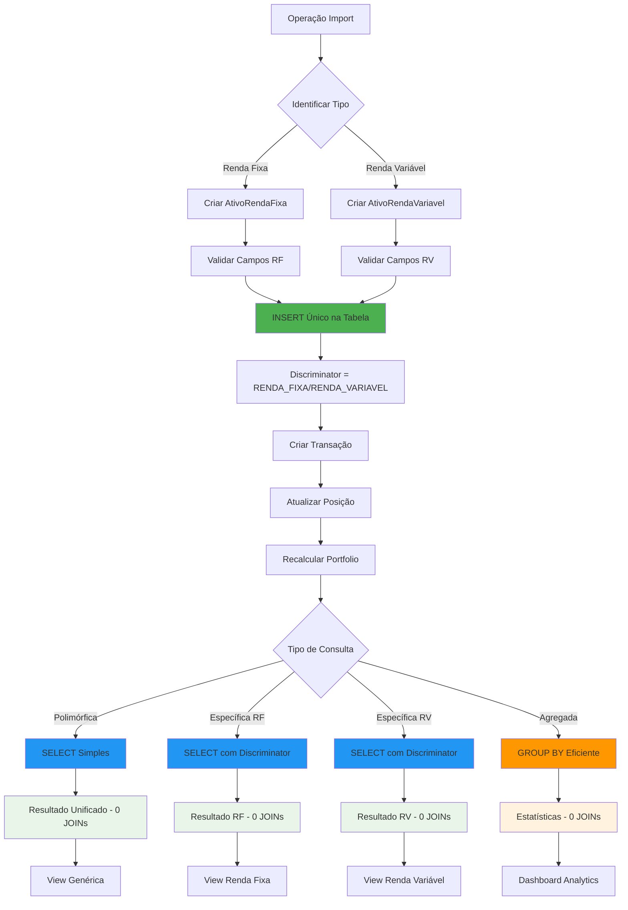

# Herança JPA - SINGLE_TABLE Strategy

## Visão Geral

Esta abordagem utiliza `@Inheritance(strategy = InheritanceType.SINGLE_TABLE)` para criar uma hierarquia de classes em uma única tabela com discriminador.

## Estrutura da Tabela

### Tabela Unificada (ativo_financeiro)
```sql
CREATE TABLE ativo_financeiro (
    -- Campos Base (sempre preenchidos)
    id BIGINT PRIMARY KEY AUTO_INCREMENT,
    codigo VARCHAR(20) NOT NULL UNIQUE,
    nome VARCHAR(200) NOT NULL,
    portfolio_id BIGINT NOT NULL,
    deletado BOOLEAN NOT NULL DEFAULT FALSE,
    tipo_ativo VARCHAR(31) NOT NULL, -- Discriminator
    created_at TIMESTAMP DEFAULT CURRENT_TIMESTAMP,
    updated_at TIMESTAMP DEFAULT CURRENT_TIMESTAMP ON UPDATE CURRENT_TIMESTAMP,
    
    -- Campos Renda Fixa (nullable para outros tipos)
    taxa_juros DECIMAL(5,2) NULL,
    data_vencimento DATE NULL,
    indexador VARCHAR(50) NULL,
    emissor VARCHAR(200) NULL,
    tipo_renda_fixa ENUM('CDB', 'LCI', 'LCA', 'TESOURO_DIRETO', 'DEBENTURE') NULL,
    valor_minimo DECIMAL(15,2) NULL,
    liquidez_diaria BOOLEAN NULL,
    
    -- Campos Renda Variável (nullable para outros tipos)
    tipo_acao ENUM('ACAO', 'FII', 'ETF', 'BDR') NULL,
    setor VARCHAR(100) NULL,
    segmento VARCHAR(100) NULL,
    ticker_yahoo VARCHAR(20) NULL,
    dividend_yield DECIMAL(5,4) NULL,
    free_float DECIMAL(5,2) NULL,
    market_cap BIGINT NULL,
    
    -- Índices
    INDEX idx_ativo_codigo (codigo),
    INDEX idx_ativo_tipo (tipo_ativo),
    INDEX idx_ativo_portfolio (portfolio_id),
    INDEX idx_rf_tipo (tipo_renda_fixa),
    INDEX idx_rf_vencimento (data_vencimento),
    INDEX idx_rf_emissor (emissor),
    INDEX idx_rv_tipo (tipo_acao),
    INDEX idx_rv_setor (setor),
    INDEX idx_rv_ticker (ticker_yahoo),
    
    FOREIGN KEY (portfolio_id) REFERENCES portfolio(id),
    
    -- Constraints condicionais (via triggers ou application-level)
    CONSTRAINT chk_renda_fixa_fields 
        CHECK (tipo_ativo != 'RENDA_FIXA' OR 
               (taxa_juros IS NOT NULL AND emissor IS NOT NULL AND tipo_renda_fixa IS NOT NULL)),
    
    CONSTRAINT chk_renda_variavel_fields 
        CHECK (tipo_ativo != 'RENDA_VARIAVEL' OR 
               (tipo_acao IS NOT NULL))
);
```

## Estrutura das Classes JPA

### Classe Base
```java
@Entity
@Table(name = "ativo_financeiro")
@Inheritance(strategy = InheritanceType.SINGLE_TABLE)
@DiscriminatorColumn(name = "tipo_ativo", discriminatorType = DiscriminatorType.STRING)
public abstract class AtivoFinanceiro {
    
    @Id
    @GeneratedValue(strategy = GenerationType.IDENTITY)
    private Long id;
    
    @Column(name = "codigo", nullable = false, unique = true, length = 20)
    private String codigo;
    
    @Column(name = "nome", nullable = false, length = 200)
    private String nome;
    
    @ManyToOne(fetch = FetchType.LAZY)
    @JoinColumn(name = "portfolio_id", nullable = false)
    private PortfolioEntity portfolio;
    
    @Column(name = "deletado", nullable = false)
    private Boolean deletado = false;
    
    @OneToMany(mappedBy = "ativoFinanceiro", cascade = CascadeType.ALL, fetch = FetchType.LAZY)
    private List<TransacaoEntity> transacoes = new ArrayList<>();
    
    @OneToMany(mappedBy = "ativoFinanceiro", cascade = CascadeType.ALL, fetch = FetchType.LAZY)
    private List<PosicaoEntity> posicoes = new ArrayList<>();
    
    @Column(name = "created_at", updatable = false)
    private LocalDateTime createdAt;
    
    @Column(name = "updated_at")
    private LocalDateTime updatedAt;
    
    // Métodos abstratos
    public abstract TipoAtivo getTipoAtivo();
    public abstract String getDescricaoCompleta();
    public abstract void validarCamposObrigatorios();
    
    // Métodos de ciclo de vida
    @PrePersist
    protected void onCreate() {
        this.createdAt = LocalDateTime.now();
        this.updatedAt = LocalDateTime.now();
        validarCamposObrigatorios();
    }
    
    @PreUpdate
    protected void onUpdate() {
        this.updatedAt = LocalDateTime.now();
        validarCamposObrigatorios();
    }
    
    // Getters e Setters...
}
```

### Subclasse - Renda Fixa
```java
@Entity
@DiscriminatorValue("RENDA_FIXA")
public class AtivoRendaFixa extends AtivoFinanceiro {
    
    @Column(name = "taxa_juros", precision = 5, scale = 2)
    private BigDecimal taxaJuros;
    
    @Column(name = "data_vencimento")
    private LocalDate dataVencimento;
    
    @Column(name = "indexador", length = 50)
    private String indexador;
    
    @Column(name = "emissor", length = 200)
    private String emissor;
    
    @Enumerated(EnumType.STRING)
    @Column(name = "tipo_renda_fixa")
    private TipoRendaFixa tipoRendaFixa;
    
    @Column(name = "valor_minimo", precision = 15, scale = 2)
    private BigDecimal valorMinimo;
    
    @Column(name = "liquidez_diaria")
    private Boolean liquidezDiaria;
    
    @Override
    public TipoAtivo getTipoAtivo() {
        return TipoAtivo.RENDA_FIXA;
    }
    
    @Override
    public String getDescricaoCompleta() {
        return String.format("%s - %s (%s) - %.2f%%", 
            getNome(), emissor, tipoRendaFixa, taxaJuros);
    }
    
    @Override
    public void validarCamposObrigatorios() {
        if (taxaJuros == null) {
            throw new IllegalStateException("Taxa de juros é obrigatória para Renda Fixa");
        }
        if (StringUtils.isBlank(emissor)) {
            throw new IllegalStateException("Emissor é obrigatório para Renda Fixa");
        }
        if (tipoRendaFixa == null) {
            throw new IllegalStateException("Tipo de Renda Fixa é obrigatório");
        }
    }
    
    // Métodos específicos
    public boolean isVencido() {
        return dataVencimento != null && dataVencimento.isBefore(LocalDate.now());
    }
    
    public long getDiasParaVencimento() {
        return dataVencimento != null ? 
            ChronoUnit.DAYS.between(LocalDate.now(), dataVencimento) : 0;
    }
    
    public BigDecimal calcularRendimentoProjetado(BigDecimal valorInvestido) {
        if (dataVencimento == null || taxaJuros == null) return BigDecimal.ZERO;
        
        long dias = getDiasParaVencimento();
        BigDecimal taxaDiaria = taxaJuros.divide(BigDecimal.valueOf(365), 8, RoundingMode.HALF_UP);
        return valorInvestido.multiply(taxaDiaria).multiply(BigDecimal.valueOf(dias));
    }
    
    // Getters e Setters...
}
```

### Subclasse - Renda Variável
```java
@Entity
@DiscriminatorValue("RENDA_VARIAVEL")
public class AtivoRendaVariavel extends AtivoFinanceiro {
    
    @Enumerated(EnumType.STRING)
    @Column(name = "tipo_acao")
    private TipoAcao tipoAcao;
    
    @Column(name = "setor", length = 100)
    private String setor;
    
    @Column(name = "segmento", length = 100)
    private String segmento;
    
    @Column(name = "ticker_yahoo", length = 20)
    private String tickerYahoo;
    
    @Column(name = "dividend_yield", precision = 5, scale = 4)
    private BigDecimal dividendYield;
    
    @Column(name = "free_float", precision = 5, scale = 2)
    private BigDecimal freeFloat;
    
    @Column(name = "market_cap")
    private Long marketCap;
    
    @Override
    public TipoAtivo getTipoAtivo() {
        return TipoAtivo.RENDA_VARIAVEL;
    }
    
    @Override
    public String getDescricaoCompleta() {
        return String.format("%s (%s) - %s - %s", 
            getNome(), getCodigo(), tipoAcao, setor);
    }
    
    @Override
    public void validarCamposObrigatorios() {
        if (tipoAcao == null) {
            throw new IllegalStateException("Tipo de Ação é obrigatório para Renda Variável");
        }
    }
    
    // Métodos específicos
    public boolean isAcao() {
        return TipoAcao.ACAO.equals(tipoAcao);
    }
    
    public boolean isFII() {
        return TipoAcao.FII.equals(tipoAcao);
    }
    
    public String getTickerFormatado() {
        return tickerYahoo != null ? tickerYahoo : getCodigo() + ".SA";
    }
    
    public boolean isHighDividendYield() {
        return dividendYield != null && 
               dividendYield.compareTo(BigDecimal.valueOf(0.06)) > 0; // > 6%
    }
    
    public boolean isLargeCap() {
        return marketCap != null && marketCap > 10_000_000_000L; // > 10B
    }
    
    // Getters e Setters...
}
```

## Repositórios Especializados

### Repository Base
```java
@Repository
public interface AtivoFinanceiroRepository 
    extends JpaRepository<AtivoFinanceiro, Long> {
    
    Optional<AtivoFinanceiro> findByCodigo(String codigo);
    List<AtivoFinanceiro> findByPortfolioIdAndDeletadoFalse(Long portfolioId);
    
    // Consultas polimórficas (muito eficientes em SINGLE_TABLE)
    @Query("SELECT a FROM AtivoFinanceiro a WHERE TYPE(a) = AtivoRendaFixa")
    List<AtivoRendaFixa> findAllRendaFixa();
    
    @Query("SELECT a FROM AtivoFinanceiro a WHERE TYPE(a) = AtivoRendaVariavel")
    List<AtivoRendaVariavel> findAllRendaVariavel();
    
    // Consultas usando discriminator (mais eficiente)
    @Query("SELECT a FROM AtivoFinanceiro a WHERE a.class = 'RENDA_FIXA'")
    List<AtivoRendaFixa> findRendaFixaByDiscriminator();
}
```

### Repository Renda Fixa
```java
@Repository
public interface AtivoRendaFixaRepository 
    extends JpaRepository<AtivoRendaFixa, Long> {
    
    // Consultas diretas (muito eficientes - sem JOINs)
    List<AtivoRendaFixa> findByTipoRendaFixa(TipoRendaFixa tipo);
    List<AtivoRendaFixa> findByEmissor(String emissor);
    
    @Query("SELECT a FROM AtivoRendaFixa a WHERE a.dataVencimento BETWEEN :inicio AND :fim")
    List<AtivoRendaFixa> findByVencimentoEntre(
        @Param("inicio") LocalDate inicio, 
        @Param("fim") LocalDate fim);
    
    @Query("SELECT a FROM AtivoRendaFixa a WHERE a.taxaJuros >= :taxaMinima")
    List<AtivoRendaFixa> findByTaxaJurosMaiorIgual(@Param("taxaMinima") BigDecimal taxaMinima);
    
    // Consultas agregadas eficientes
    @Query("SELECT a.emissor, COUNT(a), AVG(a.taxaJuros) FROM AtivoRendaFixa a GROUP BY a.emissor")
    List<Object[]> estatisticasPorEmissor();
    
    @Query("SELECT a.tipoRendaFixa, SUM(p.valorAtual) FROM AtivoRendaFixa a " +
           "JOIN a.posicoes p WHERE p.deletado = false GROUP BY a.tipoRendaFixa")
    List<Object[]> valorTotalPorTipo();
}
```

### Repository Renda Variável
```java
@Repository
public interface AtivoRendaVariavelRepository 
    extends JpaRepository<AtivoRendaVariavel, Long> {
    
    // Consultas diretas (muito eficientes - sem JOINs)
    List<AtivoRendaVariavel> findByTipoAcao(TipoAcao tipoAcao);
    List<AtivoRendaVariavel> findBySetor(String setor);
    List<AtivoRendaVariavel> findBySegmento(String segmento);
    
    @Query("SELECT a FROM AtivoRendaVariavel a WHERE a.dividendYield >= :yieldMinimo")
    List<AtivoRendaVariavel> findByDividendYieldMaiorIgual(@Param("yieldMinimo") BigDecimal yieldMinimo);
    
    @Query("SELECT a FROM AtivoRendaVariavel a WHERE a.marketCap >= :capMinimo")
    List<AtivoRendaVariavel> findByMarketCapMaiorIgual(@Param("capMinimo") Long capMinimo);
    
    // Consultas agregadas eficientes
    @Query("SELECT a.setor, COUNT(a), AVG(a.dividendYield) FROM AtivoRendaVariavel a " +
           "WHERE a.tipoAcao = 'ACAO' GROUP BY a.setor")
    List<Object[]> estatisticasAcoesPorSetor();
    
    @Query("SELECT a.tipoAcao, COUNT(a), SUM(p.valorAtual) FROM AtivoRendaVariavel a " +
           "JOIN a.posicoes p WHERE p.deletado = false GROUP BY a.tipoAcao")
    List<Object[]> resumoPorTipoAcao();
}
```

## Exemplos de Uso

### Criação de Ativos
```java
@Service
public class AtivoService {
    
    @Autowired
    private AtivoRendaFixaRepository rendaFixaRepository;
    
    @Autowired
    private AtivoRendaVariavelRepository rendaVariavelRepository;
    
    public AtivoRendaFixa criarCDB() {
        AtivoRendaFixa cdb = new AtivoRendaFixa();
        cdb.setCodigo("CDB001");
        cdb.setNome("CDB Banco Inter");
        cdb.setTipoRendaFixa(TipoRendaFixa.CDB);
        cdb.setTaxaJuros(new BigDecimal("12.50"));
        cdb.setDataVencimento(LocalDate.of(2025, 6, 15));
        cdb.setIndexador("CDI");
        cdb.setEmissor("Banco Inter S.A.");
        cdb.setValorMinimo(new BigDecimal("1000.00"));
        cdb.setLiquidezDiaria(false);
        
        return rendaFixaRepository.save(cdb);
    }
    
    public AtivoRendaVariavel criarFII() {
        AtivoRendaVariavel fii = new AtivoRendaVariavel();
        fii.setCodigo("HGLG11");
        fii.setNome("CSHG Logística FII");
        fii.setTipoAcao(TipoAcao.FII);
        fii.setSetor("Logística");
        fii.setSegmento("Galpões Logísticos");
        fii.setTickerYahoo("HGLG11.SA");
        fii.setDividendYield(new BigDecimal("0.0920"));
        fii.setFreeFloat(new BigDecimal("85.5"));
        fii.setMarketCap(2500000000L);
        
        return rendaVariavelRepository.save(fii);
    }
}
```

### Consultas Otimizadas
```java
@Service
public class RelatorioService {
    
    @Autowired
    private AtivoFinanceiroRepository ativoRepository;
    
    @Autowired
    private AtivoRendaFixaRepository rendaFixaRepository;
    
    @Autowired
    private AtivoRendaVariavelRepository rendaVariavelRepository;
    
    // Consulta polimórfica super eficiente (sem JOINs)
    public List<AtivoFinanceiro> buscarTodosAtivos() {
        return ativoRepository.findAll(); // Uma única query, uma única tabela
    }
    
    // Consultas especializadas também eficientes
    public Map<TipoRendaFixa, BigDecimal> distribuicaoRendaFixa() {
        return rendaFixaRepository.valorTotalPorTipo()
            .stream()
            .collect(Collectors.toMap(
                row -> (TipoRendaFixa) row[0],
                row -> (BigDecimal) row[1]
            ));
    }
    
    public List<AtivoRendaVariavel> topFIIsPorDividendo() {
        return rendaVariavelRepository.findByTipoAcao(TipoAcao.FII)
            .stream()
            .filter(AtivoRendaVariavel::isHighDividendYield)
            .sorted((a, b) -> b.getDividendYield().compareTo(a.getDividendYield()))
            .limit(10)
            .collect(Collectors.toList());
    }
    
    // Relatório consolidado super eficiente
    public RelatorioConsolidado gerarRelatorioCompleto(Long portfolioId) {
        // Uma única query para buscar todos os ativos
        List<AtivoFinanceiro> ativos = ativoRepository.findByPortfolioIdAndDeletadoFalse(portfolioId);
        
        // Separação em memória (muito rápido)
        List<AtivoRendaFixa> rendaFixa = ativos.stream()
            .filter(a -> a instanceof AtivoRendaFixa)
            .map(a -> (AtivoRendaFixa) a)
            .collect(Collectors.toList());
            
        List<AtivoRendaVariavel> rendaVariavel = ativos.stream()
            .filter(a -> a instanceof AtivoRendaVariavel)
            .map(a -> (AtivoRendaVariavel) a)
            .collect(Collectors.toList());
        
        return RelatorioConsolidado.builder()
            .totalAtivos(ativos.size())
            .rendaFixa(rendaFixa)
            .rendaVariavel(rendaVariavel)
            .build();
    }
}
```

### Performance Benchmarks
```java
@Service
public class PerformanceTestService {
    
    @Autowired
    private AtivoFinanceiroRepository ativoRepository;
    
    // Teste: Buscar todos os ativos (SINGLE_TABLE é muito mais rápido)
    @Timed("buscar_todos_ativos")
    public List<AtivoFinanceiro> buscarTodosAtivos() {
        // SINGLE_TABLE: 1 query, 0 JOINs
        // JOINED: 1 query + N JOINs (onde N = número de subclasses)
        return ativoRepository.findAll();
    }
    
    // Teste: Buscar ativos por portfolio (SINGLE_TABLE é mais rápido)
    @Timed("buscar_por_portfolio")
    public List<AtivoFinanceiro> buscarPorPortfolio(Long portfolioId) {
        // SINGLE_TABLE: 1 query simples com WHERE
        // JOINED: 1 query + JOINs para cada subclasse
        return ativoRepository.findByPortfolioIdAndDeletadoFalse(portfolioId);
    }
    
    // Teste: Inserção em lote (SINGLE_TABLE é mais rápido)
    @Timed("insercao_lote")
    @Transactional
    public void inserirLoteAtivos(List<AtivoFinanceiro> ativos) {
        // SINGLE_TABLE: 1 INSERT por ativo
        // JOINED: 2 INSERTs por ativo (base + específica)
        ativoRepository.saveAll(ativos);
    }
}
```

## Fluxo de Dados Detalhado



## Vantagens

✅ **Performance Excepcional**: Consultas sem JOINs, muito mais rápidas
✅ **Simplicidade**: Uma única tabela, estrutura mais simples
✅ **Consultas Polimórficas Eficientes**: Buscar todos os tipos é instantâneo
✅ **Inserção Rápida**: Um único INSERT por registro
✅ **Agregações Eficientes**: GROUP BY e estatísticas muito rápidas
✅ **Migração Simples**: Menos complexidade estrutural
✅ **Backup/Restore Simples**: Uma única tabela

## Desvantagens

❌ **Desperdício de Espaço**: Campos NULL para tipos não aplicáveis
❌ **Constraints Limitadas**: Difícil aplicar NOT NULL condicionais
❌ **Crescimento da Tabela**: Pode ficar muito larga com muitos tipos
❌ **Validação Complexa**: Lógica de validação deve ser na aplicação
❌ **Índices Menos Eficientes**: Índices em campos que podem ser NULL

## Comparação de Performance

### Consultas Polimórficas
```sql
-- SINGLE_TABLE (muito mais rápido)
SELECT * FROM ativo_financeiro WHERE portfolio_id = 1;

-- JOINED (mais lento devido aos JOINs)
SELECT a.*, rf.*, rv.* 
FROM ativo_financeiro a
LEFT JOIN ativo_renda_fixa rf ON a.id = rf.id
LEFT JOIN ativo_renda_variavel rv ON a.id = rv.id
WHERE a.portfolio_id = 1;
```

### Consultas Específicas
```sql
-- SINGLE_TABLE (rápido, sem JOINs)
SELECT * FROM ativo_financeiro 
WHERE tipo_ativo = 'RENDA_FIXA' AND emissor = 'Banco Inter';

-- JOINED (rápido, mas com JOIN)
SELECT a.*, rf.* 
FROM ativo_financeiro a
JOIN ativo_renda_fixa rf ON a.id = rf.id
WHERE rf.emissor = 'Banco Inter';
```

### Inserções
```sql
-- SINGLE_TABLE (1 comando)
INSERT INTO ativo_financeiro (codigo, nome, tipo_ativo, taxa_juros, emissor, ...) 
VALUES ('CDB001', 'CDB Inter', 'RENDA_FIXA', 12.5, 'Banco Inter', ...);

-- JOINED (2 comandos)
INSERT INTO ativo_financeiro (codigo, nome, tipo_ativo, ...) 
VALUES ('CDB001', 'CDB Inter', 'RENDA_FIXA', ...);

INSERT INTO ativo_renda_fixa (id, taxa_juros, emissor, ...) 
VALUES (LAST_INSERT_ID(), 12.5, 'Banco Inter', ...);
```

## Casos de Uso Ideais

- **Aplicações com foco em performance** de consulta e inserção
- **Sistemas com muitas consultas polimórficas** (buscar todos os tipos)
- **Dashboards e relatórios** que precisam de agregações rápidas
- **Aplicações com volume alto** de transações
- **Cenários onde simplicidade** é mais importante que normalização
- **Sistemas que fazem muitas consultas** do tipo "buscar todos os ativos"

## Recomendação

Para o B3DataManager, **SINGLE_TABLE é a melhor escolha** considerando:

1. **Performance**: Consultas muito mais rápidas
2. **Simplicidade**: Menos complexidade de manutenção
3. **Uso Real**: Muitas consultas polimórficas (dashboards, relatórios)
4. **Volume**: Aplicação financeira com muitas transações
5. **Flexibilidade**: Mais fácil adicionar novos campos/tipos